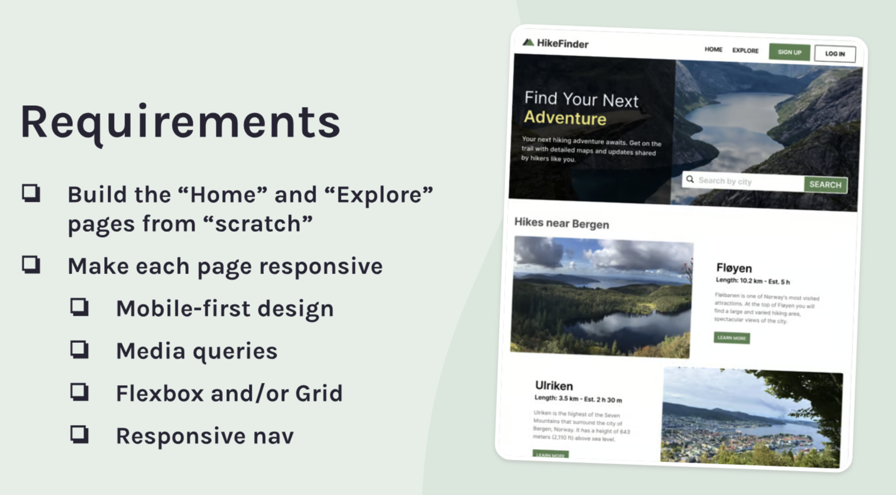

## Hike Finder

### The challenge:

This is project using HTML, CSS and JavaScript to ...

### The requirements:

### How does the app work?

### Process

- Consult Figma design files
- Create draft of README file
- Create .gitignore file and check that meta tag is included
- Create Github repository
- Work on HTML, CSS and JS files
- Check final code and accessibility
- Finalize README file
- Publish live URL

### Useful code snippets and tips

### Code Review Follow up

### Enhancement still needed

- Would like to update the project with the names and bio of the liked dogs. Need to add a "contact me" button as well.

### Resources:
